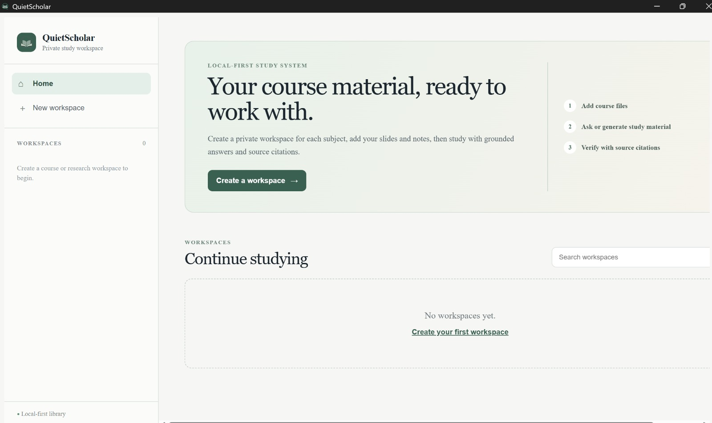
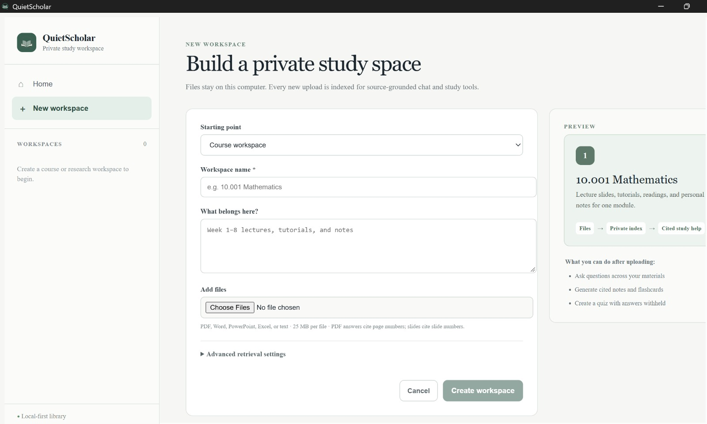

  

# QuietScholar

### Your course material. Your choice of AI. Your computer.

QuietScholar is a private, local-first desktop study companion built for university students. It turns lecture slides, readings, notes, papers, and spreadsheets into separate AI-powered study workspaces—all without sending those materials or conversations to a cloud AI service.

Unlike a conventional chatbot, QuietScholar runs the student's chosen large language model locally through [Ollama](https://ollama.com/). Documents, search indexes, workspace settings, and chat history remain on the student's own computer. Once the required local model is installed, the desktop app can be used whether or not an internet connection is available.

> **The core idea:** students should be able to use powerful, course-aware AI without trading away the privacy of their notes, unpublished research, assignments, or conversations.

## Why QuietScholar is different

Most AI study tools depend on a remote service: files leave the device, an account is required, and studying stops when the connection does. QuietScholar takes a different approach.

- **Private by design** — course files, locally created indexes, settings, and chat history are stored on the user's computer.
- **Local AI through Ollama** — students choose from supported locally deployed models, including Mistral, Llama 3.2 3B, Phi-3 Mini, and Gemma 2B.
- **Works offline** — after the model and required components have been installed, core document and chat workflows do not depend on internet access.
- **A real desktop application** — QuietScholar opens as a focused Windows app instead of another browser tab, making it easy to reach during lectures, revision sessions, or travel.
- **A specialist for every subject** — each course or research project gets its own bot-like workspace, documents, instructions, retrieval settings, and conversation history.
- **Answers grounded in the student's material** — QuietScholar retrieves relevant passages before answering and shows source references, helping students check claims against the original material.

This combination is QuietScholar's speciality: the convenience of chatting with a purpose-built AI assistant, the flexibility to choose the local model behind it, and the confidentiality of keeping the entire study library on-device.

## Built around university life

Create one workspace for calculus, another for economics, and another for a dissertation or group project. Each workspace stays separate, so the assistant for one subject does not mix its sources with another.

Students can add:

- PDF readings and papers
- Word documents
- PowerPoint lecture slides
- Excel spreadsheets
- Plain-text notes

QuietScholar indexes those files locally and makes them available for source-grounded conversation. PDF responses can point back to page numbers, PowerPoint responses to slide numbers, and spreadsheet content to sheet labels—useful when accuracy matters and the original source needs to be checked.

## From files to active study

QuietScholar is more than document search. Inside a workspace, a student can:

- Ask questions across multiple course files in natural language
- Continue follow-up conversations with local chat history
- Generate concise summaries of uploaded material
- Turn lectures and readings into revision notes
- Produce flashcards for active recall
- Create practice quizzes with answers withheld
- Review cited sources rather than accepting an unsupported response
- Keep separate study sessions for different topics or tasks

A typical workflow is simple:

1. Create a workspace for a module or research project.
2. Choose the local Ollama model that fits the computer and the task.
3. Add slides, notes, readings, or datasets.
4. Ask questions or generate study material.
5. Verify the response using its source citations.

## Privacy and confidentiality

QuietScholar is designed so that personal study data remains under the student's control:

- The language model runs locally through Ollama.
- Uploaded documents are kept in local application storage.
- Document indexes and embeddings are stored locally.
- Workspace configuration and chat history are stored in a local database.
- The application's local service listens only on the computer's loopback interface.
- Replacing the application does not overwrite the separately stored study library.

Because the core workflow does not transmit documents or prompts to a hosted LLM, sensitive notes, draft work, research material, and chat history remain confidential on the user's device. As with any local application, students should still protect their computer account, disk, and backups appropriately.

## Designed for choice

There is no single ideal model for every student or laptop. QuietScholar lets the user select a supported Ollama model per workspace. A lighter model can keep everyday study responsive on modest hardware, while a more capable locally installed model can be chosen when resources allow. Advanced controls also make it possible to tune how documents are split, how much context is retrieved, how creative the response should be, and how the assistant is instructed.

That means a research workspace can behave like a careful evidence-focused assistant, while a course workspace can act as a patient tutor—without either sending the student's material elsewhere.

## Project status

QuietScholar is a working desktop application and an exploration of private, local-first educational AI. This public repository is a **showcase only**: it contains product information and screenshots, not the application's source code, executable builds, databases, uploaded files, chat history, credentials, or private installation material.

The software is not distributed from this repository. All rights are reserved unless permission is granted in writing.
